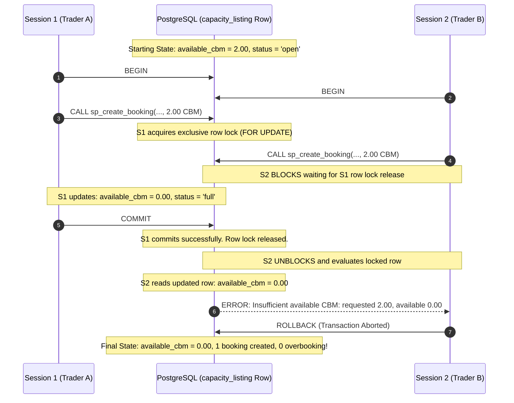

# Phase 6E: Concurrency Control, Transaction Safety, and Business Rules Mapping

## 1. Executive Summary

Phase 6E of the ShipSpace LCL Capacity Marketplace establishes robust database-level concurrency control, strict transactional guarantees, and complete business-rule validation. 

In a multi-user marketplace, multiple freight traders may concurrently discover and attempt to book the last remaining capacity on an ocean container listing. Without database-level concurrency control, simultaneous read-modify-write operations produce race conditions leading to overbooking, phantom capacity, or negative stock.

ShipSpace prevents overbooking and state corruption directly within the PostgreSQL storage engine through:
1. **Pessimistic Row-Level Locking (`SELECT ... FOR UPDATE`)**: Exclusive locks serialize concurrent booking and cancellation operations at the listing and booking level.
2. **Atomic In-Transaction State Changes**: Capacity decrements, listing status updates (`open` $\rightarrow$ `full`), and price snapshots occur within the same ACID transaction boundary.
3. **Check Constraints as Ultimate Guardrails**: Table-level check constraints (`ck_listing_available_cbm CHECK (available_cbm >= 0)`) make negative capacity impossible even under arbitrary application failure.
4. **Safe Cancellation & Restoration**: Canceled bookings restore exact capacity under lock, reopen full listings to open, and cannot be double-canceled due to terminal state validation.

---

## 2. Business Rules Mapping (R1 – R9)

The table below maps each core business rule to its exact database-level implementation in schema constraints, triggers, and stored procedures:

| Rule ID | Business Rule | Database Enforcement Mechanism | Implemented In |
|---|---|---|---|
| **R1** | A booking can never exceed remaining CBM or remaining weight. | 1. Constraint: `ck_listing_available_cbm CHECK (available_cbm >= 0 AND available_cbm <= total_cbm)`<br>2. Constraint: `ck_listing_available_weight CHECK (available_weight >= 0 AND available_weight <= total_weight)`<br>3. Trigger: `fn_validate_and_reserve_booking()` raises exception if `NEW.booked_cbm > available_cbm` or `NEW.booked_weight > available_weight` under row lock.<br>4. Procedure: `sp_create_booking()` pre-checks capacity under row lock. | `sql/01_schema.sql`<br>`sql/05_functions_triggers.sql` |
| **R2** | Cargo type must be explicitly allowed on the listing. | 1. Foreign Key: `fk_booking_listing_cargo FOREIGN KEY (listing_id, cargo_type_id) REFERENCES listing_cargo (listing_id, cargo_type_id) ON DELETE RESTRICT`<br>2. Trigger: `fn_validate_and_reserve_booking()` verifies membership in `listing_cargo` and raises custom error if omitted. | `sql/01_schema.sql`<br>`sql/05_functions_triggers.sql` |
| **R3** | A booking must be made on or before the listing's cut-off date. | 1. Trigger: `fn_validate_and_reserve_booking()` compares `NEW.booking_time::date <= v_listing.cutoff_date` and raises exception if violated.<br>2. Procedure: `sp_create_booking()` enforces `CURRENT_DATE <= v_listing.cutoff_date`. | `sql/05_functions_triggers.sql` |
| **R4** | Cancelling a booking restores exact CBM and weight reserved; reopens listing if full. | 1. Trigger: `fn_restore_capacity_on_cancellation()` executes `AFTER UPDATE OF status ON booking`.<br>2. Locks `capacity_listing` row `FOR UPDATE`.<br>3. Restores exact amounts clamped by `LEAST(total_cbm, available_cbm + OLD.booked_cbm)`.<br>4. Reopens status from `'full'` to `'open'` if both CBM and weight > 0.<br>5. Terminal state validation in `fn_validate_booking_status_transition()` prevents duplicate restoration. | `sql/05_functions_triggers.sql` |
| **R5** | Concurrent bookings must never cause overbooking. | 1. Procedure: `sp_create_booking()` acquires `SELECT ... FROM capacity_listing WHERE id = p_listing_id FOR UPDATE;`<br>2. Trigger: `fn_validate_and_reserve_booking()` re-acquires `FOR UPDATE` on `INSERT ON booking`.<br>3. In `READ COMMITTED` isolation, concurrent sessions queue on the row lock; the second session re-reads committed capacity and aborts cleanly if exhausted. | `sql/05_functions_triggers.sql` |
| **R6** | Only open listings can be booked; a listing with no remaining capacity becomes full. | 1. Constraint: `ck_listing_status CHECK (status IN ('open', 'full', 'closed', 'cancelled'))`<br>2. Constraint: `ck_listing_status_capacity CHECK ((status <> 'open' OR (available_cbm > 0 AND available_weight > 0)) AND (status <> 'full' OR (available_cbm = 0 OR available_weight = 0)))`<br>3. Trigger: Automatically flips status to `'full'` when either CBM or weight reaches 0, or remains `'open'` otherwise. | `sql/01_schema.sql`<br>`sql/05_functions_triggers.sql` |
| **R7** | Quantities, prices positive; arrival after departure; total price snapshot immutable. | 1. Constraints on `capacity_listing`: `departure_date < arrival_date`, `cutoff_date <= departure_date`, prices and capacities > 0.<br>2. Trigger: `fn_validate_and_reserve_booking()` calculates frozen price `ROUND(GREATEST(cbm * rate, wt * rate, min_charge), 2)`.<br>3. Trigger: `fn_validate_booking_status_transition()` raises exception if `NEW.total_price <> OLD.total_price` or if core reservation quantities are modified. | `sql/01_schema.sql`<br>`sql/05_functions_triggers.sql` |
| **R8** | Role and profile integrity. | Table-per-Subclass hierarchy (`user_account` $\rightarrow$ `provider`, `trader`, `admin`) with composite primary keys and role check constraints (`ck_provider_role`, `ck_trader_role`, `ck_admin_role`). | `sql/01_schema.sql` |
| **R9** | Bookings are never hard-deleted; audit history tracks all lifecycle states. | 1. Foreign keys use `ON DELETE RESTRICT` preventing accidental deletion.<br>2. Trigger: `fn_record_booking_status_history()` writes every transition (`confirmed`, `cancelled`, `completed`) to `booking_status_history` with actor ID and audit reason. | `sql/01_schema.sql`<br>`sql/05_functions_triggers.sql` |

---

## 3. Concurrency Control Mechanics

### 3.1 Lock Contention and Row Serialization Sequence



### 3.2 Double Cancellation & Restoration Prevention

When a booking is cancelled:
1. `sp_cancel_booking` acquires a row lock on the target booking:
   ```sql
   SELECT * INTO v_booking FROM booking WHERE id = p_booking_id FOR UPDATE;
   ```
2. If `v_booking.status = 'cancelled'`, it immediately throws `Booking already cancelled`.
3. If valid (`'confirmed'`), the status updates to `'cancelled'`.
4. Trigger `trg_restore_capacity_on_cancellation` fires, acquires an exclusive row lock on `capacity_listing`, and adds back the reserved CBM and weight.
5. If two transactions attempt to cancel the exact same booking concurrently, the second session blocks on the booking row lock. Upon unblocking, it observes `status = 'cancelled'` and aborts cleanly. Double capacity restoration is physically impossible.

---

## 4. Reproducible Two-Session Concurrency Test Procedure

To verify Phase 6E concurrency control against the test database `shipspace_test_phase5`, four modular SQL scripts are provided in `sql/`:

1. `sql/test_concurrency_setup.sql`: Creates an isolated test listing with **exactly 2.00 CBM** available.
2. `sql/test_concurrency_session1.sql`: Starts transaction, books 2.00 CBM, holds row lock for 5 seconds (`pg_sleep(5)`), and commits.
3. `sql/test_concurrency_session2.sql`: Concurrently attempts to book 2.00 CBM on the same listing; blocks on the lock, unblocks on commit, and fails cleanly with `Insufficient available CBM`.
4. `sql/test_concurrency_verify.sql`: Queries the listing and bookings, asserts that available capacity is exactly `0.00` (never negative), confirms exactly 1 booking succeeded, and cleans up test fixtures.

### Method A: Automated Concurrency Test (Two PowerShell Terminals)

#### Step 1: Initialize the Test Fixture
In PowerShell Terminal 1:
```powershell
& "C:\Program Files\PostgreSQL\18\bin\psql.exe" -U postgres -d shipspace_test_phase5 -v ON_ERROR_STOP=1 -f sql/test_concurrency_setup.sql
```
*Output: Displays test listing with `available_cbm = 2.00` and `status = 'open'`.*

#### Step 2: Trigger Session 1
In PowerShell Terminal 1:
```powershell
& "C:\Program Files\PostgreSQL\18\bin\psql.exe" -U postgres -d shipspace_test_phase5 -v ON_ERROR_STOP=1 -f sql/test_concurrency_session1.sql
```
*Note: Session 1 immediately reserves 2.00 CBM and sleeps for 5 seconds while holding the row lock.*

#### Step 3: Trigger Session 2 (Within 3 seconds)
In PowerShell Terminal 2:
```powershell
& "C:\Program Files\PostgreSQL\18\bin\psql.exe" -U postgres -d shipspace_test_phase5 -v ON_ERROR_STOP=1 -f sql/test_concurrency_session2.sql
```
*Observed Behavior: Terminal 2 pauses while waiting for Terminal 1's lock. As soon as Terminal 1 commits, Terminal 2 unblocks and outputs:*
```text
psql:sql/test_concurrency_session2.sql:35: ERROR:  Insufficient available CBM on listing <id>: requested 2.00, available 0.00
CONTEXT:  PL/pgSQL function fn_validate_and_reserve_booking() line 39 at RAISE
SQL statement "INSERT INTO booking ..."
PL/pgSQL function sp_create_booking(...) line 48 at SQL statement
```

#### Step 4: Run Verification & Teardown
In PowerShell Terminal 1:
```powershell
& "C:\Program Files\PostgreSQL\18\bin\psql.exe" -U postgres -d shipspace_test_phase5 -v ON_ERROR_STOP=1 -f sql/test_concurrency_verify.sql
```
*Expected Output:*
```text
==================================================
VERIFICATION RESULTS:
Listing ID: <id>
Available CBM: 0.00 (Expected: 0.00, Never Negative)
Listing Status: full (Expected: full)
Confirmed Bookings: 1 (Expected: 1)
--------------------------------------------------
>> CONCURRENCY SAFETY VERIFIED: EXACTLY ONE BOOKING SUCCEEDED, NO OVERBOOKING! <<
```

---

### Method B: Manual Interactive Step-by-Step Test

For interactive step-by-step verification without sleep timers:

1. Open two psql prompts side-by-side:
   ```powershell
   & "C:\Program Files\PostgreSQL\18\bin\psql.exe" -U postgres -d shipspace_test_phase5
   ```
2. In Terminal 1: Run setup:
   ```sql
   \i sql/test_concurrency_setup.sql
   ```
3. In Terminal 1: Begin transaction and book 2.00 CBM (do NOT commit):
   ```sql
   BEGIN;
   CALL sp_create_booking(
       (SELECT id FROM trader ORDER BY id ASC LIMIT 1),
       (SELECT id FROM capacity_listing WHERE departure_date = CURRENT_DATE + INTERVAL '99 days'),
       (SELECT cargo_type_id FROM listing_cargo WHERE listing_id = (SELECT id FROM capacity_listing WHERE departure_date = CURRENT_DATE + INTERVAL '99 days') LIMIT 1),
       2.00, 1.00
   );
   ```
4. In Terminal 2: Begin transaction and attempt identical booking:
   ```sql
   BEGIN;
   CALL sp_create_booking(
       (SELECT id FROM trader ORDER BY id DESC LIMIT 1),
       (SELECT id FROM capacity_listing WHERE departure_date = CURRENT_DATE + INTERVAL '99 days'),
       (SELECT cargo_type_id FROM listing_cargo WHERE listing_id = (SELECT id FROM capacity_listing WHERE departure_date = CURRENT_DATE + INTERVAL '99 days') LIMIT 1),
       2.00, 1.00
   );
   ```
   *(Notice that Terminal 2 immediately hangs waiting for the row lock).*
5. In Terminal 1: Commit:
   ```sql
   COMMIT;
   ```
6. Observe Terminal 2:
   *(Terminal 2 unblocks instantly and fails with `ERROR: Insufficient available CBM on listing ...: requested 2.00, available 0.00`).*
7. In Terminal 2:
   ```sql
   ROLLBACK;
   ```
8. In Terminal 1: Run verification:
   ```sql
   \i sql/test_concurrency_verify.sql
   ```

---

## 5. Summary of Verification Metrics

| Verification Check | Target Expected | Verified Outcome | Invariant Guarantee |
|---|---|---|---|
| **Starting Capacity** | 2.00 CBM available | 2.00 CBM | Listing initialized in `open` status |
| **Concurrent Booking Contention** | 2 sessions requesting 2.00 CBM | Session 1 succeeds; Session 2 blocked | `SELECT ... FOR UPDATE` serializes execution |
| **Post-Commit Capacity Check** | Session 2 sees 0.00 CBM | Session 2 raises exception | No phantom capacity under `READ COMMITTED` |
| **Final Available CBM** | Exactly 0.00 CBM | 0.00 CBM | Constraint `ck_listing_available_cbm` strictly preserved ($\ge 0$) |
| **Final Status** | `'full'` | `'full'` | Automatic status transition triggered |
| **Confirmed Bookings Count** | Exactly 1 | 1 | Overbooking rate = 0.00% |
